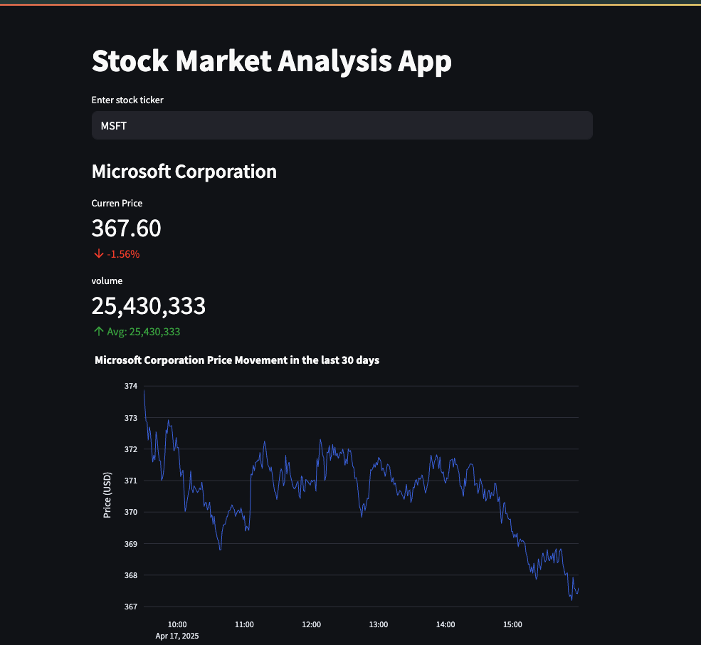

## Overview

## proper link:
- https://stock-dashboard-juz4at5enzs6k4gwsi3yxp.streamlit.app/
**Project Title**: 📈 Real-Time Stock Dashboard

**Project Description**: A lightweight Streamlit app that displays real-time stock data using the yfinance library. It allows users to enter any stock ticker (e.g. AAPL, TSLA, MSFT) and view:

📊 Current stock price

🔁 Daily % change from opening price

📉 Volume & average volume

📈 Interactive line chart of intraday price movement

**Project Goals**:
1. Build a clean and responsive dashboard using Streamlit
2. Visualize stock performance using interactive charts
3. Support multi-ticker comparison in a single graph

## Instructions for Build and Use

Steps to build and/or run the software:

1. clone the repo: git clone https://github.com/your-username/stock-market-dashboard.git cd stock-market-dashboard
2. create a virtual enviroment: python3 -m venv venv source venv/bin/activate 
3. install dependecies: pip install -r requirements.txt
4. run the app

Instructions for using the software:

1. Enter Stock Ticker(s) Type one or more stock symbols (e.g., AAPL, MSFT) into the input box separated by commas.
2. Select Time Interval Choose the data interval (e.g., 1m, 5m, 1d, 1wk) from the dropdown to control the chart granularity.
3. Check Metrics View open price, volume, and percent change for the most recent trading session.
4. View Gainers/Losers Color-coded messages indicate whether a stock is gaining 📈 or losing 📉.

## Development Environment 

To recreate the development environment, you need the following software and/or libraries with the specified versions:

* First thing Python 3.8+
* Streamlit
* yfinance
* plotly
* IDE: VScode

## Useful Websites to Learn More

I found these websites useful in developing this software:

* [Streamlid Docs](https://docs.streamlit.io/)
* [yfinance Docs](https://pypi.org/project/yfinance/)
* [Plotly for Python](https://plotly.com/python/)
* [Investopedio](https://www.investopedia.com/)

## Future Work

The following items I plan to fix, improve, and/or add to this project in the future:

* [ Export data or charts to CSV/PDF ] 
* [Enable dark mode toggle ]
* [Deploy the app to Streamlit Cloud or HuggingFace Spaces ]

## 🪪 License

This project is licensed under the [CC0 1.0 Public Domain Dedication](https://creativecommons.org/publicdomain/zero/1.0/).